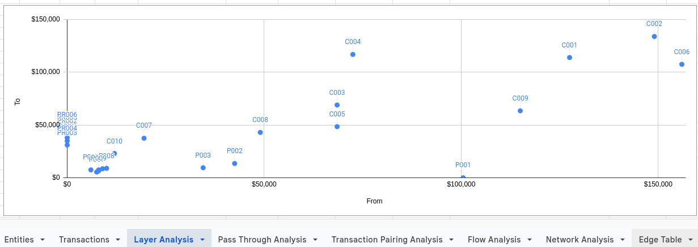
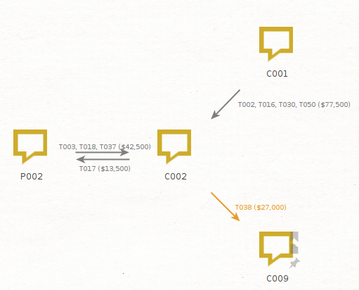
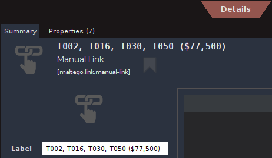

# Project Cedar — Financial Investigation & Network Analysis

> **Fictional financial-investigation case study demonstrating transaction analysis, relationship extraction, and spreadsheet-to-Maltego network visualisation.**

## Overview

Project Cedar is a structured investigative exercise demonstrating how transaction-level financial data can be transformed into a documented relationship analysis and visualised as an investigative network.

The project follows a practical workflow:

**Raw transaction data → spreadsheet analysis → relationship extraction → Maltego network visualisation → investigative assessment**

The objective is not to establish criminal conduct. It is to demonstrate disciplined investigative analysis: identifying observable financial relationships, preserving the link to underlying transaction evidence, distinguishing fact from inference, considering alternative explanations, and identifying issues that warrant further investigation.

---

## Investigative Objectives

Project Cedar focuses on:

- analysing incoming and outgoing financial activity by entity;
- identifying timing patterns and screening for potential pass-through activity;
- consolidating transaction records into entity-to-entity relationships;
- preserving transaction identifiers and aggregate amounts as supporting evidence;
- visualising selected relationships in Maltego; and
- documenting observations, limitations, and investigative questions.

---

## Analytical Workflow

```text
Transaction Dataset
        │
        ▼
Google Sheets
        │
        ├── Layer / timing analysis
        ├── Pass-through screening
        └── Relationship extraction
        │
        ▼
Maltego Import CSV
        │
        ▼
Maltego Graph
        │
        ▼
Investigative observations & report
```

---

## 1. Transaction and Spreadsheet Analysis

The initial analysis uses the transaction dataset to examine the movement of funds through the entities in the fictional case.

The spreadsheet analysis includes:

- incoming and outgoing transaction timing;
- transaction amounts and counterparties;
- screening for potential pass-through patterns; and
- consolidation of transaction records into directed entity-to-entity relationships.

### Screenshot 1 — Spreadsheet Analysis



*Figure 1. Spreadsheet analysis of Project Cedar transaction data.*

---

## 2. Relationship Extraction

The transaction-level records are then converted into a relationship-level edge table.

Rather than displaying every individual transaction as a separate relationship, repeated transactions between the same entities are consolidated into a directed edge while retaining the transaction IDs and aggregate observed amount.

Example:

| From | Relationship | To | Transaction(s) | Total Amount |
|---|---|---|---|---:|
| C001 | Transferred funds to | C002 | T002, T016, T030, T050 | $77,500 |
| P002 | Transferred funds to | C002 | T003, T018, T037 | $42,500 |
| C002 | Transferred funds to | P002 | T017 | $13,500 |
| C002 | Transferred funds to | C009 | T038 | $27,000 |

This creates a clean hand-off between spreadsheet analysis and Maltego visualisation.

### Evidence Traceability

Each relationship remains traceable to the underlying transaction records through transaction identifiers.

For example:

> **C002 → P002**  
> Supporting transaction: **T017**  
> Observed amount: **$13,500**

The aggregate amount represents the observed total of the transactions included in that relationship. It is not presented as proof of the source, purpose, or legal character of the funds.

---

## 3. Maltego Network visualisation

The selected relationships are exported as a CSV and imported into Maltego to demonstrate the transition from structured financial analysis to network visualisation.

The portfolio graph intentionally remains small and readable. The purpose is to demonstrate the workflow and evidentiary linkage rather than create a complex intelligence network.

The core relationship structure is:

```text
C001 ───────► C002 ───────► C009
               │
               ▼
              P002
               │
               └──────────► C002
```

### Screenshot 2 — Maltego Relationship Map



*Figure 2. Maltego visualisation of selected financial relationships identified through spreadsheet analysis.*

---

## 4. Evidence Behind the Graph

The Maltego visualisation represents relationships derived from the transaction dataset rather than relationships asserted independently of the evidence.

A useful example is the relationship:

> **C002 → P002**

which is supported by transaction **T017**.

The reverse relationship:

> **P002 → C002**

is separately supported by transaction records including **T037**.

This distinction matters because a network diagram should make relationships easier to understand without obscuring the underlying evidentiary basis.

### Screenshot 3 — Maltego Link Evidence



*Figure 3. Example of the underlying transaction evidence associated with a visualised Maltego relationship.*

---

## Key Analytical Principle

Project Cedar deliberately separates three levels of assessment:

### Observed Fact

What the source data directly demonstrates.

Example:

> The dataset records a transfer from C002 to P002 under transaction T017.

### Analytical Inference

A pattern or relationship identified through analysis.

Example:

> C002 and P002 have observed financial activity in both directions during the period covered by the dataset.

### Investigative Hypothesis

A question or possible explanation requiring additional evidence.

Example:

> What economic purpose explains the transfers between C002 and P002?

This distinction is central to the project. A financial relationship, transaction sequence, or timing pattern does not by itself establish unlawful conduct.

---

## Investigative Questions Generated by the Analysis

The analysis is designed to generate questions rather than prematurely resolve them.

Examples include:

- What was the purpose of the transfers between C002 and P002?
- What documentary evidence explains the transactions?
- Are the transactions connected economically, or are they independent events?
- What legitimate explanations could account for the observed pattern?
- What additional records would be required to test those explanations?

These questions illustrate how structured financial analysis can support subsequent investigative work.

---

## Alternative Explanations

Potential innocent explanations are considered before assigning investigative significance to an observed relationship.

Depending on the facts developed in a real investigation, reciprocal or rapid transfers could potentially reflect:

- loans and repayments;
- reimbursements;
- purchases and refunds;
- business services;
- related-party transactions;
- property transactions; or
- corrections or reversals of earlier payments.

Project Cedar treats these as hypotheses requiring evidence rather than conclusions.

---

## Limitations

Project Cedar is a fictional training exercise using synthetic case data.

The project does not establish:

- the legal character of any transaction;
- the purpose of any transaction beyond what the available source data states;
- beneficial ownership unless independently established;
- that any transfer represents proceeds of unlawful activity; or
- a causal connection between transactions merely because they occur close together in time.

A real investigation would require additional evidence and appropriate investigative authorities, potentially including financial records, corporate records, property records, documentary evidence, interviews, and open-source research.

---

## Tools

- **Google Sheets** — transaction analysis, timing analysis, aggregation, and relationship extraction
- **CSV** — structured transfer of relationship data
- **Maltego Graph** — link and network visualisation
- **GitHub** — documentation, reproducibility, and portfolio presentation

---

## Repository Structure

```text
project-cedar-financial-investigation/
│
├── README.md
│
├── analysis/
│   └── Project-Cedar-Analysis.xlsx
│
├── report/
│   └── Project-Cedar-Investigation-Report.pdf
│
└── screenshots/
    ├── 01-spreadsheet-analysis.png
    ├── 02-maltego-relationship-map.png
    └── 03-maltego-link-evidence.png
```

---

## Professional Competencies Demonstrated

Project Cedar demonstrates the ability to:

- work systematically with transaction-level financial data;
- identify and structure entity-to-entity financial relationships;
- preserve a traceable connection between analytical products and source transactions;
- use timing and transaction patterns to generate investigative leads;
- distinguish evidence from inference and hypothesis;
- consider alternative explanations;
- translate structured analysis into network visualisation; and
- communicate findings and limitations in a clear, defensible manner.

---

## Project Status

**Portfolio case study — core financial-analysis and spreadsheet-to-Maltego workflow completed.**

Future development may extend the exercise into additional open-source research, network analysis, documentary evidence, and a more comprehensive investigative case file.

---

## Disclaimer

Project Cedar is a fictional training exercise created for professional development and portfolio purposes. All entities, identifiers, transactions, and investigative scenarios should be treated as synthetic unless explicitly identified otherwise.
